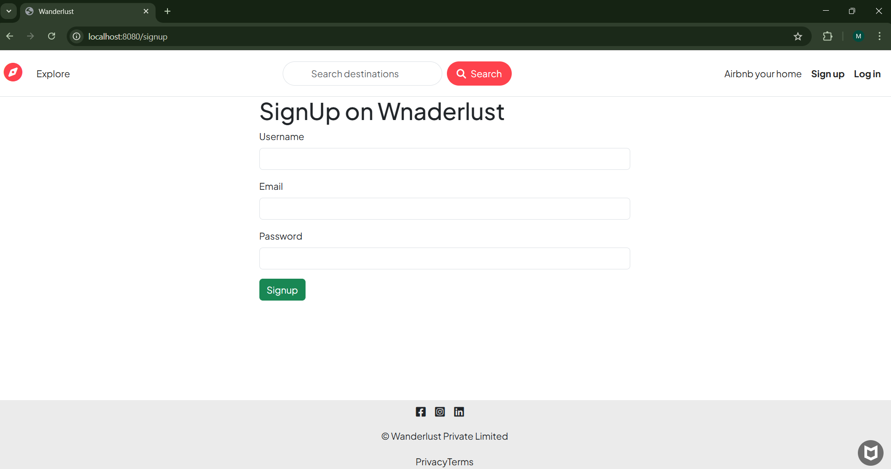
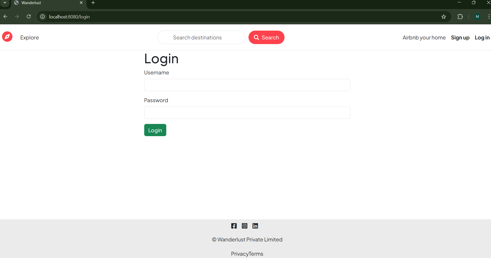
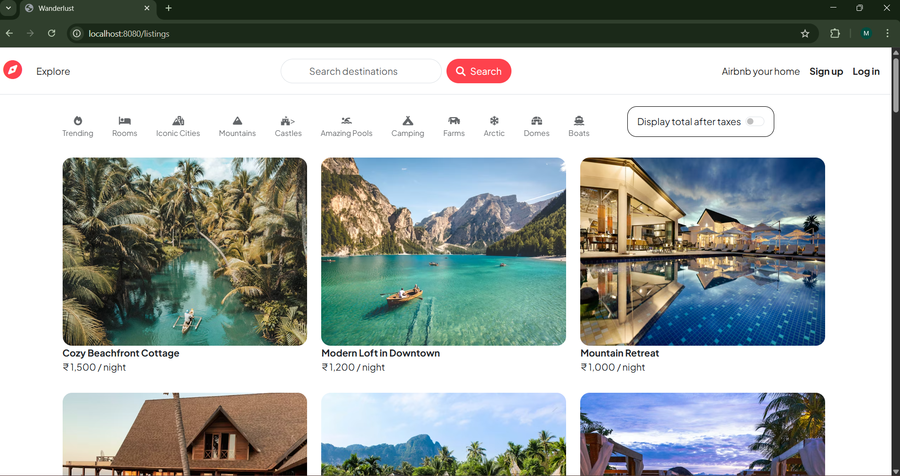

 # 🌍 Wanderlust

Wanderlust is a full-stack Airbnb-style web application built using Node.js, Express, MongoDB, and EJS.

## 🚀 Features
- User authentication
- Create & manage listings
- Reviews and ratings

## 🛠 Tech Stack
- Node.js
- Express.js
- MongoDB
- EJS

## 👩‍💻 Author
Muskan Pawar

## Screenshots

### Signup Page

### Login Page

### Home Page

